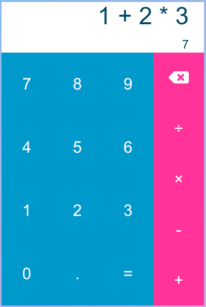

# React Calculator
A calculator similar to Android's calculator, that shows the expression and result.
Check it out at [calc.thewordisbird.dev](calc.thewordisbird.dev).

## Motivation
I built this to reinforce the content I've recently learned about React and React hooks.
This also gave me an oppurtunity to incorporate postfix expression evaluation which
I've always found interesting since reading about it.

## Technologies
* React with React Hooks
* JavaScript
* html
* CSS

## Setup/Installation
This project was bootstrapped with [Create React App](https://github.com/facebook/create-react-app).

## License
MIT License